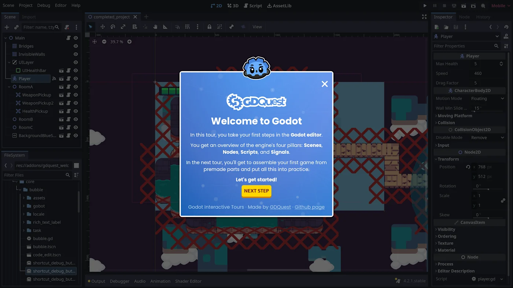

# Godot Tours

Godot Tours is a framework to create interactive, step-by-step tutorials in the Godot editor.



It is a technology we use at GDQuest to create guided tours. This technology is free and open-source so you are welcome to study and use it.

**Minimum required Godot version: Godot 4.2 standard** (*not* the .NET edition)

**Warning: Godot Tours is an experimental project.** While it appears to work fairly reliably in Godot 4.2 stable, we are still refining the API as we're producing interactive tours. Please note that we may make breaking changes to the tour API with new releases to polish it.

## Support and contributions

Given our limited resources, and the amount of work that this project represents, it is currently provided as-is: we do not offer individual or community support on this.

If you wish to contribute, please get in touch first to ensure that your contribution aligns with the project goals, and please note that our availability to review contributions is limited.

If it's something we also need or plan to work on, we'll likely be able to review reasonably fast. Otherwise, we can't promise that we'll have time to review or that we'll merge your work. 

## Creating tours

A tour is a GDScript file that extends `res://addons/godot_tours/core/tour.gd`.

To learn how to use the framework and create a tour, we invite you to check out the open-source tour [101 - The Godot Editor](https://github.com/gdquest-demos/godot-tours-101-the-godot-editor). You can use it as a reference to build your own tours.

Also, we invite you to open the file `res://addons/godot_tours/core/tour.gd` to learn more about how the system works and see all of the functions provided to build tours.
## Registering tours

To register a tour in the menu that appears upon opening the Godot project, you need to create a resource file named `godot_tours.tres` at the root of the Godot project. It should extend the file `res://addons/godot_tours/core/godot_tour_list.gd`.
## Features overview

Godot Tours comes with these features, in the `core` folder of the addon:

- The UI Bubble which provides step-by-step instructions and explanations. It contains:
  - An optional header.
  - Any number of text descriptions, media (images, videos), code listings, and (verifiable) tasks added to the body.
  - An optional footer.
  - The Godot Bot animated avatar.
- A debug dock which helps instructors prepare and navigate the tours, toggled with <kbd>CTRL</kbd><kbd>F10</kbd>.
- A Mouse Preview for previewing actions such as: Drag n' Drop, Click, Press, Release.
- An Overlays manager that prevents students from interacting with the *Editor Interface* UI elements. The instructor can give access to the underlying UI elements using highlights that disable the overlays on mouse-over.
- A Translation system provides two functions:
  1. A Parser that extracts strings used in `gtr()`, `gtr_n()` and `ptr()` function calls.
  2. A `*.[mo,po]` files loader and mapper depending on the *Editor* language setting.
- A Tour builder API that constructs the actual guided steps using the systems listed so far.

## Using Godot Tours in Other Projects

Godot Tours works like any other Godot addon. You can clone or download the repository files and copy and paste the addons folder to your project.

The easiest way to keep this addon up to date is to use the addon manager [gd-plug](https://github.com/imjp94/gd-plug):

1. Install **gd-plug** using the Godot Asset Library.
2. Save the following code into the file `res://plug.gd` (create the file if necessary):

  ```gdscript
  #!/usr/bin/env -S godot --headless --script
  extends "res://addons/gd-plug/plug.gd"


  func _plugging() -> void:
  	plug(
  		"git@github.com:GDQuest/godot-tours.git",
  		{include = ["addons/godot_tours"]}
  	)
  ```

3. On Linux, make the `res://plug.gd` script executable with `chmod +x plug.gd`.
4. Using the command line, run `./plug.gd install` or `godot --headless --script plug.gd install`.
